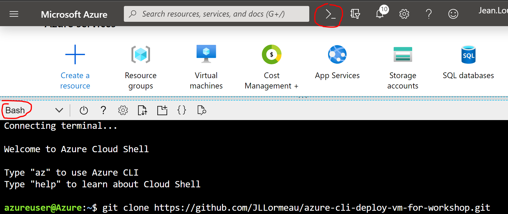

# azure-cli-deploy-vm-for-workshop
This script permits to deploy quickly several Ubuntu VM with Docker Engine on an Azure subscription. It's very usefull for a workshop. It's compatible with easytravel on docker. Usefull to deploy quickly a Dynatrace training environment.

Open your azure subscription, https://portal.azure.com/  
Open azurecli like describe here :  

to deploy several ubuntu VM on Azure, use this command on azurecli:  
**git clone https://github.com/JLLormeau/azure-cli-deploy-vm-for-workshop.git  
cd azure-cli-deploy-vm-for-workshop  
chmod +x azure-cli-deploy-vm-for-workshop.sh  
./azure-cli-deploy-vm-for-workshop.sh**  

You can create several ubuntu VM, for example for 2 VM with this domain name = dttrainingjll, we will create on azure these 2 VM :  
hostname : dttrainingjll00.westeurope.cloudapp.azure.com with usr = USER00 & Pwd = Dynatrace@2019 & Size = Standard_F1  
hostname : dttrainingjll01.westeurope.cloudapp.azure.com with usr = USER01 & Pwd = Dynatrace@2019 & Size = Standard_F1  

Go to the VM with putty and deploy easytravel on each VM with these commands
**sudo apt-get install git  
git clone https://github.com/JLLormeau/dynatracelab_easytraveld.git  
cd dynatracelab_easytraveld  
sudo docker-compose up -d**  

In thise example, we create 2 easytravel application :  
http://dttrainingjll00.westeurope.cloudapp.azure.com  
http://dttrainingjll01.westeurope.cloudapp.azure.com  

to restart easytravel use these commands on each VM :  
**cd dynatracelab_easytraveld  
docker-compose down  
sudo docker-compose up -d**  

at the end of the workshop, open your azure portal and delete the ressource groups.  
